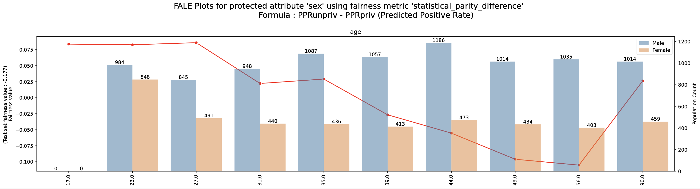

# FALE Fairness Aware ALE Plots



This repository is the implementation of the paper [Fairness Aware ALE Plots (FALE)](https://arxiv.org/abs/2404.18685). <br>
FALE acts as an efficient, user friendly, comprehensible and reliable first-stage tool for identifying subgroups with potential bias issues. In particular, we extend the ALE plots explainability method, proposing FALE (Fairness aware Accumulated Local Effects) plots, a method for measuring the change in fairness for an affected population corresponding to different values of a feature (attribute).

## Structure
    .
    ├── examples                  # Folder containing example notebooks and relevant files 
    │   ├── FALE2D.ipynb
    │   ├── FALE_Final(LogisticReg).ipynb
    │   ├── FALE_Final(XGBoost).ipynb
    │   ├── FALE_Final(RFclass).ipynb
    ├── src                     # Source code folder
    │   ├── FALElib.py              # Contains the code of FALE framework
    │   ├── FALElib2D.py          # Contains the code of FALE2D framework
    │   ├── __init__.py               
    │   └── helpers.py           # Contains helper functions
    └── ...                     # README, requirements.txt, gitignore
    
## Requirements
All experiments were run on the [Anaconda](https://www.anaconda.com/) platform using python version 3.9.16. To avoid bugs due to incompatible package versions, we have exported the [txt file](requirements.txt) for the conda environment on which we worked.

To create a conda environment with the same configuration, run:

```setup
conda create -n fale python=3.9.16
```

then activate it with

```setup
conda activate fale
```

and install the necessary dependencies with

```
pip install -r requirements.txt
```
## References

This work was developed on top of the [OmniXAI](https://github.com/salesforce/OmniXAI) package:

### BibTeX
```bibtex
@article{wenzhuo2022-omnixai,
  author    = {Wenzhuo Yang and Hung Le and Silvio Savarese and Steven Hoi},
  title     = {OmniXAI: A Library for Explainable AI},
  year      = {2022},
  doi       = {10.48550/ARXIV.2206.01612},
  url       = {https://arxiv.org/abs/2206.01612},
  archivePrefix = {arXiv},
  eprint    = {2206.01612},
}
